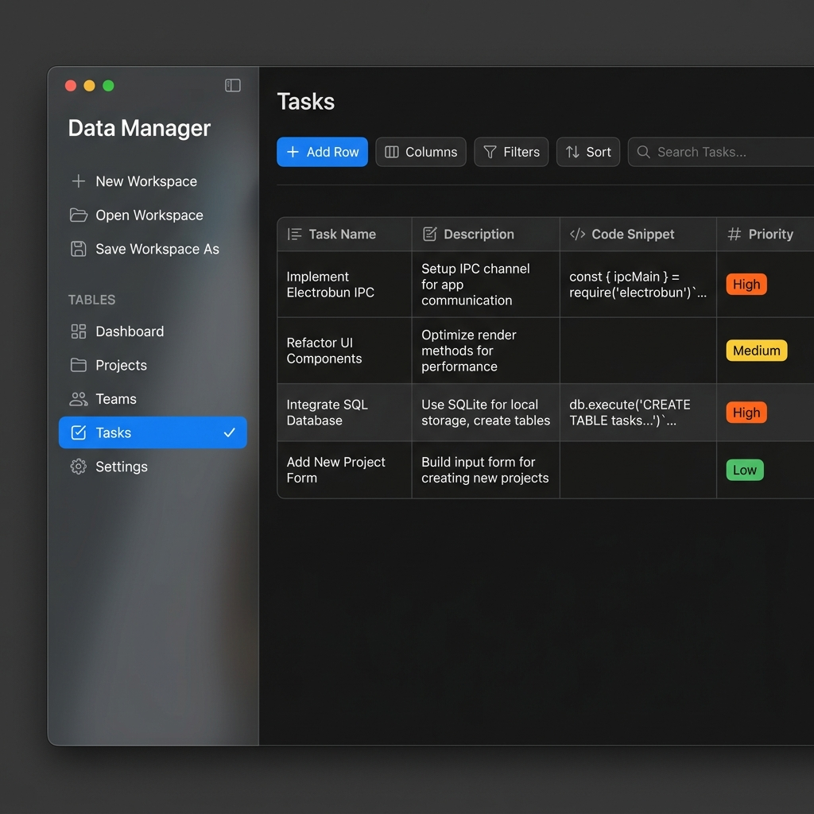
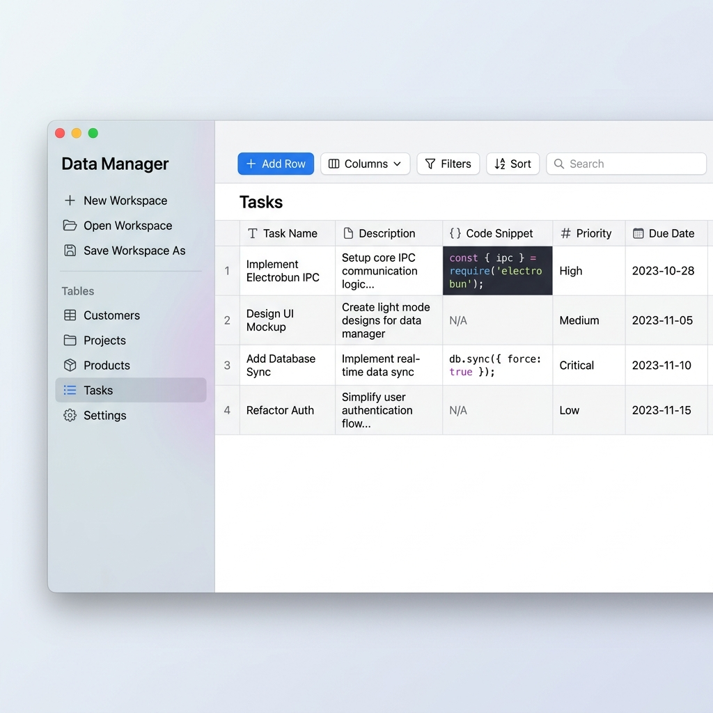

# Electrobun Data Manager

A lightweight, native macOS desktop spreadsheet and database table manager application built with [Electrobun](https://blackboard.sh/electrobun), React, TypeScript, and Tailwind CSS. 

Unlike traditional Electron applications, **Electrobun** uses a ultra-lightweight native webview combined with Bun, resulting in extremely fast startup times, minimal memory footprint, and low CPU overhead.

---

## 📸 Screenshots

### Dark Mode


### Light Mode


---

## ✨ Features

- **📂 Native Workspace Management**
  - Save your spreadsheets to disk as clean JSON schemas.
  - Choose directory locations, create new workspaces, or load existing workspace backups.
  - Auto-remembers your last opened workspace, window frame position, and theme preference.
  - **Asynchronous Auto-Save**: Workspace changes are saved natively to disk in the background (debounced at 800ms) to prevent data loss.

- **🗂️ Multi-Table Workspace**
  - Create, rename, or delete sheets dynamically.
  - macOS-inspired vertical sidebar navigation.
  - **Drag-and-Drop Reordering**: Rearrange your table tabs in the sidebar by dragging them vertically.

- **🛠️ Rich Column & Data Type Control**
  - Add, rename, or delete columns with specialized types:
    - 🔤 **Text**: Standard single-line text input.
    - 📝 **Long Text**: Multi-line description field.
    - 🔢 **Number**: Number validation with automatic casting on export.
    - 📅 **Date / Time / Date & Time**: Native calendar/clock picker inputs.
    - 💻 **Code**: Syntax-optimized code block cell.
  - **Horizontal Reordering**: Grab any column header and drag it horizontally to rearrange the column order.
  - **Smart Indentation**: Pressing `Tab` key inside Code or Long Text fields inserts a literal tab (`\t`) instead of moving input focus.

- **🔍 Advanced Querying Panel**
  - **Multi-Clause Filters (AND logic)**: Construct advanced filters against any column using conditional operators (*Contains, Equals, Not Equals, Starts With, Ends With, Greater/Less Than, Is Empty, Is Not Empty*).
  - **Hierarchical Sorting**: Chain multiple nested sorting rules (e.g., sort by *Priority* ascending, then by *Due Date* descending).

- **📋 System Clipboard & Disk Export**
  - **Save to Disk**: Export individual tables or your entire workspace structure as a structured JSON file.
  - **Instant Clipboard Export**: Convert table data on the fly and copy to your system clipboard as:
    - Javascript Object Array
    - Python List of Dicts (automatically translates `True`/`False`/`None`)
    - JavaScript/Python Workspace maps (all sheets exported simultaneously)

---

## 🚀 Getting Started

### Prerequisites

- **Bun**: Ensure you have [Bun](https://bun.sh) installed on your system.

### Installation

```bash
# Clone the repository and navigate to the project directory
cd electrobun_datamanager

# Install dependencies
bun install
```

### Running the Application

For the best development experience, run the app with Hot Module Replacement (HMR) enabled:

```bash
# Run with Hot Module Replacement (Vite Dev Server + Electrobun Window)
bun run dev:hmr
```

For testing production-bundled assets locally without HMR:

```bash
# Bundle assets and start Electrobun
bun run dev
```

### Building for Release

```bash
# Build production bundle
bun run build

# Package the application for production release
bun run build:prod
```

---

## 🏗️ Architecture & RPC Communication

Electrobun separates the execution into two main spaces:
1. **Main Process (Bun)**: Runs in the Bun runtime, handles OS actions (file dialogue window, system clipboard, config file writes, system theme setting).
2. **Webview Process (Vite/React)**: Runs the user interface inside a native macOS WKWebView.

Communication between these two runtimes is handled through a **type-safe RPC schema** defined in [types.ts](file:///Users/codecaine/electrobun_datamanager/src/shared/types.ts):

```typescript
export type DataManagerRPCSchema = {
	bun: RPCSchema<{
		requests: {
			loadData: { params: void; response: { data: any; filePath: string | null } };
			saveData: { params: { data: any; filePath: string | null }; response: { success: boolean } };
			openFile: { params: void; response: { data: any; filePath: string | null } | null };
			saveFileAs: { params: { data: any; filename?: string }; response: { success: boolean; filePath: string } | null };
			exportFile: { params: { content: string; defaultName: string }; response: { success: boolean } };
			copyToClipboard: { params: { text: string }; response: { success: boolean } };
			getTheme: { params: void; response: { theme: "light" | "dark" } };
			setTheme: { params: { theme: "light" | "dark" }; response: { success: boolean } };
		};
		messages: {
			logToBun: { msg: string };
		};
	}>;
	webview: RPCSchema<{
		requests: {};
		messages: {
			logToWebview: { msg: string };
		};
	}>;
};
```

---

## 📁 Project Structure

```
├── screenshots/
│   ├── screenshot_dark.png    # App mockup in dark theme
│   └── screenshot_light.png   # App mockup in light theme
├── src/
│   ├── bun/
│   │   └── index.ts           # Main process (Electrobun window & file system handler)
│   ├── mainview/
│   │   ├── components/
│   │   │   └── TableGrid.tsx  # Dynamic interactive spreadsheet component
│   │   ├── App.tsx            # React state manager, sidebar, modals & toolbar UI
│   │   ├── main.tsx           # React entry point
│   │   ├── index.html         # Webview page template
│   │   ├── index.css          # Tailwind configurations & native style overrides
│   │   └── rpc.ts             # Webview-side RPC interface definition
│   └── shared/
│       └── types.ts           # Shared type schemas & RPC definition mapping
├── electrobun.config.ts       # Electrobun app build config
├── vite.config.ts             # Vite bundle settings
├── tailwind.config.js         # Tailwind stylesheet rules
└── package.json               # Package metadata and runtime scripts
```

